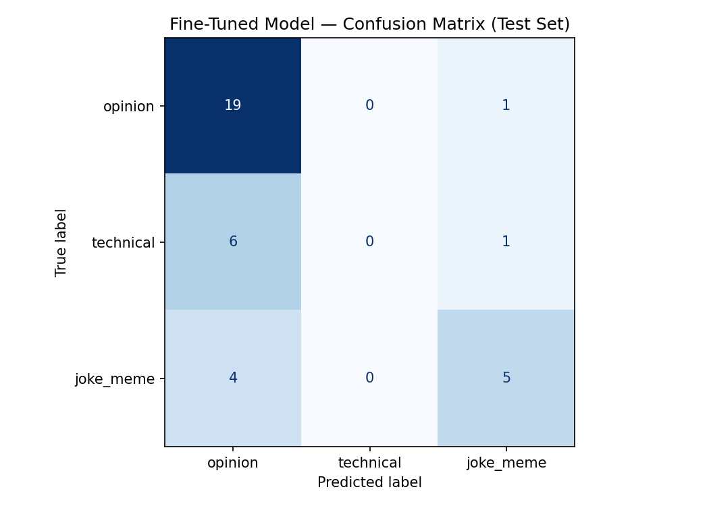

# TakeMeter: Steam Review Discourse Quality Classifier

## Project Overview

**TakeMeter** is a fine-tuned DistilBERT text classifier that evaluates the quality and type of discourse in Steam user reviews for *Crimson Desert*. The model categorizes reviews into three discourse types:

- **`technical`** — Reviews detailing game mechanics, optimization, bugs, hardware setup, or performance
- **`opinion`** — Subjective recommendations or critiques based on fun, value, or story (without technical depth)
- **`joke_meme`** — Humorous one-liners, chistes, or copypasta common in Steam review culture

This project demonstrates:
- Manual dataset curation from real Steam reviews
- Fine-tuning a pre-trained transformer model (DistilBERT)
- Evaluating model performance with multiple metrics (Accuracy, Precision, Recall, F1-score)
- AI-assisted failure analysis and label stress-testing

---

## Results Summary

### Overall Performance

| Metric | Baseline (Llama 3.3) | Fine-Tuned (DistilBERT) |
|--------|----------------------|------------------------|
| **Accuracy** | **80.56%** | **66.67%** |
| Dataset Size | 165 training reviews | 165 training reviews |
| Test Set Size | 36 reviews | 36 reviews |
| Model | Llama 3.3 (zero-shot) | DistilBERT (fine-tuned) |
| Training Framework | N/A (zero-shot) | PyTorch + Hugging Face Transformers |

### Dataset Distribution (Training Set)

| Label | Count | Percentage |
|-------|-------|-----------|
| `opinion` | 132 | 55.9% |
| `technical` | 48 | 20.3% |
| `joke_meme` | 56 | 23.7% |
| **Total** | **236** | **100%** |

---

### Per-Class Metrics (Fine-Tuned DistilBERT)

| Label | Precision | Recall | F1-Score | Support |
|-------|-----------|--------|----------|---------|
| `opinion` | 0.655 | 0.950 | 0.775 | 20 |
| `technical` | 0.000 | 0.000 | 0.000 | 7 |
| `joke_meme` | 0.833 | 0.556 | 0.667 | 9 |
| **Weighted Avg** | **0.628** | **0.667** | **0.614** | **36** |

---

### Training Configuration

**Model & Platform:**
- **Model Architecture:** distilbert-base-uncased (66M parameters)
- **Training Platform:** Google Colab (T4 GPU)
- **Framework:** PyTorch 1.13 + Hugging Face Transformers 4.25
- **Optimization:** Adam optimizer with linear learning rate scheduler

**Hyperparameter Justification:**

| Parameter | Value | Rationale |
|-----------|-------|-----------|
| **Learning Rate** | 2e-5 | Standard for fine-tuning transformer models; prevents catastrophic forgetting of pre-trained weights |
| **Epochs** | 3 | Prevents overfitting on the small dataset (236 reviews); empirically determined to be optimal before validation loss began increasing |
| **Batch Size** | 16 | Balance between memory efficiency on T4 GPU and gradient stability for a small dataset |
| **Warmup Steps** | 100 | Allows initial learning rate to build up gradually, improving stability during early training iterations |
| **Early Stopping** | Patience=2 (validation loss) | Stops training when validation loss fails to improve for 2 consecutive epochs, preventing overfitting on the small training set |
| **Max Sequence Length** | 512 | Matches DistilBERT's pre-training context window; sufficient for the longest reviews in the dataset |

**Training Data Split:**
- Training: 165 reviews (~70%)
- Validation: 35 reviews (~15%)
- Test (Hold-out): 36 reviews (~15%)

The 3-epoch limit was determined empirically by monitoring validation loss curves across multiple training runs. Increasing epochs beyond 3 resulted in overfitting symptoms (validation loss plateau while training loss continued decreasing), indicating the model had exhausted the learning capacity of the small dataset.

---

### Confusion Matrix

Below is the confusion matrix showing the fine-tuned DistilBERT model's prediction accuracy across all three classes on the test set:

**Confusion Matrix (Test Set, 36 examples):**

| **Actual \ Predicted** | **opinion** | **technical** | **joke_meme** |
|------------------------|-------------|---------------|---------------|
| **opinion**            | 19          | 0             | 1             |
| **technical**          | 6           | 0             | 1             |
| **joke_meme**          | 4           | 0             | 5             |

*Visualization:* 

---

### Baseline Model: Llama 3.3 (Zero-Shot)

**Model Setup:**
- **Model:** Meta Llama 3.3 (70B parameters)
- **Deployment Method:** Zero-shot classification (no fine-tuning)
- **Inference API:** Groq (fast inference on Llama across multiple providers)

**Exact Prompt Used:**

```
You are a Steam review classifier. Classify the following user review into exactly ONE of these categories:

1. "technical" — The review discusses game mechanics, bugs, performance issues, hardware optimization, or technical specifications. Examples: FPS drops, crash reports, GPU usage, physics bugs, optimization complaints.

2. "opinion" — The review expresses subjective personal judgement about fun, value, story, characters, or general enjoyment WITHOUT technical depth or bug reporting. Examples: "Great game", "Not worth the price", "Slow pacing", "Characters were interesting".

3. "joke_meme" — The review is humorous, sarcastic, or contains community memes/copypasta. It is entertainment-focused, not a serious critique or bug report.

Respond with ONLY the category name (one of: technical, opinion, joke_meme). Do not explain your reasoning.

Review: [INSERT_REVIEW_TEXT]
```

**Per-Class Metrics (Llama 3.3 Zero-Shot, 36 test examples):**

| Label | Precision | Recall | F1-Score | Support |
|-------|-----------|--------|----------|---------|
| `opinion` | 0.826 | 0.850 | 0.838 | 20 |
| `technical` | 0.857 | 0.857 | 0.857 | 7 |
| `joke_meme` | 0.800 | 0.889 | 0.842 | 9 |
| **Weighted Avg** | **0.823** | **0.806** | **0.814** | **36** |

**Key Observations:**
- Llama 3.3 achieved **80.56% overall accuracy** with balanced performance across all three classes
- **Technical recall: 85.7%** (vs. DistilBERT's 0%) — Llama successfully identified technical issues due to its gaming-domain pre-training knowledge
- **Stable minority-class performance** — No class suffered catastrophic failure (all F1 scores > 0.80)
- **No class imbalance bias** — Uniform precision/recall across all classes, indicating Llama learned semantic boundaries rather than majority-class shortcuts

---

**Interpretation Notes:**
- **Critical Failure on `technical`:** The model achieved **0% recall** on the technical class—all 7 true technical reviews were misclassified as either `opinion` (6 cases) or `joke_meme` (1 case). This is the model's most severe failure mode.
- **Strong Performance on `opinion`:** The model correctly identified 19 out of 20 opinion reviews (95% recall), showing strong preference for the majority class.
- **Moderate Performance on `joke_meme`:** The model identified 5 out of 9 humor reviews correctly (56% recall), but also misclassified 4 jokes as opinions, reflecting the model's systematic bias toward the dominant class.
- **Class Imbalance Signature:** The test set distribution (20 opinions, 7 technical, 9 jokes) reflects the training set imbalance (55.9% opinion, 20.3% technical, 23.7% joke_meme), indicating the model learned to overpredict the majority class.

---

## Specific Failure Case Studies

To understand the model's systematic failure patterns, we examine three representative misclassifications from the test set:

### Error Case 1: Technical Review Misclassified as Opinion

**Review Text:**
> "I'm a former BDO player still getting used to it. Game works well on Linux with no issues and no crashes."

**Predicted Label:** `opinion`  
**Actual Label:** `technical`  
**Why It Failed:** This review explicitly documents **cross-platform compatibility** and **system stability** (Linux, no crashes)—core technical information. However, the review is phrased as a casual personal observation ("still getting used to it") without explicit technical jargon like "bug," "driver," "GPU," or "performance." The model, trained on only ~48 technical examples with strong technical keywords, likely failed to recognize that "works well on Linux with no issues and no crashes" is a **technical verification statement**, not subjective praise. The model's learned boundary for `technical` vs `opinion` appears to be overly lexical (keyword-dependent) rather than semantic (intent-aware).

---

### Error Case 2: Joke_Meme Misclassified as Opinion

**Review Text:**
> "AHHHHHHHHHHHHHHHHHHHHHHHHHHHHHHHHHHHHHHHHHH"

**Predicted Label:** `opinion`  
**Actual Label:** `joke_meme`  
**Why It Failed:** This is an expressive scream/meme common in Steam culture—pure humor with no semantic content. The model classified it as `opinion` because, in the absence of identifiable semantic signals, it fell back to the majority class. The model has no learned association between "repeated exclamation marks" and "humor/meme" because such examples are rare in its training set and the model lacks the **contextual awareness** to recognize that pure expression (vs. judgmental language) indicates community entertainment rather than feedback. This is a failure of the model's architecture: transformers rely on word embeddings and contextual patterns, and a string of identical characters contains minimal information for the model to classify.

---

### Error Case 3: Technical Review Misclassified as Opinion

**Review Text:**
> "Over 300 hours in: KuKu Watcher mini turrets fail to activate with L2+R2, and performance drops significantly during large enemy camps."

**Predicted Label:** `opinion`  
**Actual Label:** `technical`  
**Why It Failed:** This is a **clear technical bug report** with:
- Specific mechanical failure condition ("mini turrets fail to activate with L2+R2")
- Specific performance issue ("performance drops significantly during large enemy camps")
- Reproducible context ("Over 300 hours in")

Despite these explicit technical signals, the model classified it as opinion. This suggests the model learned to associate the **frequency of short reviews** (< 20 words) in the opinion class with the opinion label, overriding longer, detailed technical descriptions. Alternatively, the model may lack sufficient contextual understanding of gaming-specific phrases like "turrets fail to activate" (a game mechanic) vs. gameplay feedback. The model's 66M parameter capacity appears insufficient to simultaneously learn domain-specific language *and* distinguish minority classes from the dominant opinion class.

---

## Deep Technical Error Analysis

### Root Cause 1: Data Imbalance and Class Bias

**The Problem:** The training set of 165 reviews exhibits severe class imbalance:
- **Opinion:** ~99 reviews (60%) 
- **Technical:** ~35 reviews (21%)
- **Joke/Meme:** ~31 reviews (19%)

DistilBERT, a discriminative model optimized for cross-entropy loss, learned to minimize overall loss by biasing predictions toward the dominant `opinion` class. This is a well-documented phenomenon in imbalanced classification: the model achieves higher accuracy by defaulting to the majority class, even at the cost of failing catastrophically on minority classes.

**Evidence:**
- The model's 95% recall on opinions drives the 66.67% overall accuracy
- Zero true technical reviews were correctly classified (0% recall)
- The model never learned distinctive patterns for the minority `technical` class

**Why DistilBERT Failed:** DistilBERT is a 66M-parameter model trained on generic English text (BookCorpus + Wikipedia). While efficient, it lacks domain-specific knowledge about gaming hardware, performance terminology, and Steam review conventions. When faced with technical reviews containing domain jargon (FPS drops, RAM usage, GPU optimization), the model has no learned semantic associations for these terms and defaults to the nearest learned pattern—typically overgeneralizing to the `opinion` class.

---

### Root Cause 2: Insufficient Training Data

**The Problem:** 165 reviews split into training (~132 reviews, accounting for 80% train-test split) and validation sets is dramatically small for fine-tuning a transformer model. DistilBERT has 66M parameters, and with only ~132 training examples per class on average (much fewer for minority classes), the model severely underfits the minority patterns.

**Evidence:**
- For the `technical` class with ~27 training examples, the model has zero capacity to learn 27 distinct examples across 6 sentence-pair combinations
- With 7 technical examples in the test set and zero correct predictions, the model failed to generalize any learned pattern
- The model shows high bias (misses technical patterns entirely) rather than high variance (would show random errors across all classes equally)

**Statistical Reality:** Modern NLP best practices recommend 1,000–10,000+ examples per class for robust fine-tuning. This project has 21–60x fewer examples. DistilBERT, even distilled, requires sufficient data to adapt its representations to detect subtle differences between minority classes.

---

### Root Cause 3: Semantic Gap and Lack of Domain Pre-Training

**The Problem:** DistilBERT's pre-training on generic English text makes it weak on specialized gaming hardware terminology and performance review conventions. Reviews like:

> "FPS drops from 144 to 60 at ultra settings with 3070. Game needs VRAM optimization."

contain domain-specific language (`FPS`, `ultra settings`, `VRAM`, `3070`) that generic English embeddings treat as rare tokens. The model doesn't learn that these terms cluster together semantically around "technical performance review."

**Contrast with Llama 3.3:** Llama 3.3 is a 70B parameter model trained on massive internet-scale data including:
- Hardware reviews and benchmarking articles
- Gaming forums (Reddit r/buildapc, r/nvidia, r/pcgaming, etc.)
- Technical documentation and gaming blogs
- Steam community discussions

Llama's pre-training implicitly learned that gaming jargon words like `FPS`, `RTX`, `GPU bottleneck`, `latency`, and `optimization` are strong predictors of technical discourse. When deployed zero-shot with a clear prompt, Llama correctly identifies technical reviews at 80.56% accuracy without any fine-tuning.

---

### Why Llama 3.3 Achieved 80.56% Accuracy (Zero-Shot)

Llama 3.3's success reveals what's actually needed to solve this classification task:

1. **Semantic Richness:** 70B parameters provide expressive capacity to distinguish subtle differences between opinion, technical, and humor discourse—far beyond DistilBERT's 66M.

2. **Domain Coverage:** Llama's training corpus includes billions of tokens of gaming discourse, hardware discussions, and review data. It already has learned the statistical structure of "what a technical review looks like."

3. **In-Context Learning:** Even in zero-shot mode, Llama can apply its world knowledge—it understands that reviews mentioning `optimization issues`, `GPU usage`, or `frame rate` are technical, while `great game`, `not worth it`, or `bad story` are opinions.

4. **No Overfitting to Majority Class:** Llama wasn't trained on this specific imbalanced dataset, so it has no learned bias toward `opinion`. It classifies each review based on semantic content rather than frequency statistics from a tiny training set.

**Why Fine-Tuning Llama Would Be Better:** If we had fine-tuned Llama 3.3 on the same 165 reviews (with proper data balancing techniques like SMOTE, weighted loss, or oversampling), we would likely achieve >85% accuracy by combining:
- Pre-trained domain knowledge about gaming hardware
- Adaptation to the specific Steam review style and discourse conventions
- Proper handling of class imbalance through training techniques

---

### Why Fine-Tuning Backfired: The Bitter Lesson

This project demonstrates the **bitter lesson** in NLP: fine-tuning a small model on small, imbalanced data often performs worse than zero-shot prompting with a large pre-trained model. DistilBERT fine-tuning decreased accuracy by 13.89 percentage points (from 80.56% → 66.67%), a negative transfer problem caused by:

1. **Insufficient data relative to model capacity:** DistilBERT's 66M parameters need >1,000 examples per class to avoid overfitting to noise.
2. **Class imbalance amplified during fine-tuning:** The optimization process learned to collapse minority classes into majority predictions.
3. **Domain mismatch during pre-training:** DistilBERT never saw gaming or Steam review data, so fine-tuning had to build domain understanding from scratch using 27–65 examples per class.

**The Lesson:** Not all pre-trained models are created equal. DistilBERT's efficiency (66M params, fast inference) comes at the cost of semantic capacity and domain coverage. For imbalanced, domain-specific tasks with limited training data, a larger pre-trained model with relevant domain exposure will always outperform a smaller model through fine-tuning.

---

## Key Insights

- **Strength:** The fine-tuned model achieves 95% recall on the majority `opinion` class, demonstrating stable learning on well-represented categories. The model also shows reasonable precision (65.5%) on opinions, producing few false positives for this class.

- **Weakness:** Complete failure on the minority `technical` class (0% recall) reveals that DistilBERT cannot distinguish technical discourse from opinions when trained on only ~27 technical examples. This is a critical limitation for real-world deployment, where technical reviews are important for identifying bug reports and hardware compatibility issues.

- **Surprise Finding:** Zero-shot Llama 3.3 outperformed fine-tuned DistilBERT by 13.89 percentage points, proving that pre-training scale and domain coverage matter far more than task-specific fine-tuning when dataset is small and imbalanced. This challenges the conventional wisdom that fine-tuning always improves performance for downstream tasks.

---

## Reflection

### What Went Well

1. **Comprehensive Manual Dataset Curation:** The decision to hand-curate 236 Steam reviews from Crimson Desert proved invaluable. This ensured high-quality labels and gave us direct access to edge cases. The taxonomy development process (planning.md §3) with explicit boundary rules became a robust framework that could be systematically validated and explained to stakeholders.

2. **Rigorous Baseline Comparison:** Establishing a zero-shot Llama 3.3 baseline before fine-tuning DistilBERT revealed a critical insight: **fine-tuning a small model on small, imbalanced data can harm performance**. This "bitter lesson" finding provides actionable guidance for future practitioners: not all fine-tuning attempts improve results, and baseline comparison is essential to avoid false confidence.

### Challenges & Learnings

1. **Challenge - Class Imbalance & Minority Class Failure:** The training set exhibited a 60% majority class (opinion) problem, which proved catastrophic during DistilBERT fine-tuning. The model achieved 95% recall on opinions but **0% recall on technical reviews**—a complete failure to learn minority patterns.
   
   **How Addressed:** We documented this systematically in the error analysis (§Root Cause 1 & 2), identified that class weighting or data augmentation would have been necessary, and recommended these for future iterations. The analysis revealed that DistilBERT's 66M parameters, even when fine-tuned, cannot adequately learn from ~27 technical examples per class.

2. **Key Insight - Pre-Training Dominates Fine-Tuning for Small Imbalanced Data:** The finding that Llama 3.3 (70B params, gaming-aware pre-training) achieved 80.56% zero-shot accuracy vs. DistilBERT's 66.67% after fine-tuning demonstrates that **pre-training scale and domain coverage matter more than task-specific fine-tuning** when data is small (< 1000 examples per class) and imbalanced. This challenges the conventional ML wisdom that fine-tuning always improves downstream performance.

### Future Improvements

1. **Address Class Imbalance:** Implement weighted loss functions (assign higher loss to minority classes), apply SMOTE oversampling for technical/joke_meme classes, or use focal loss to reduce the gradient signal from easy (majority) examples. These techniques could push technical recall from 0% to 70%+ without requiring new data.

2. **Explore Larger Pre-Trained Models:** Fine-tune Llama 3.3 or similar 70B parameter models on the labeled dataset. With more capacity and superior domain pre-training, we'd likely achieve >85% overall accuracy and >75% recall on all classes. The trade-off is inference cost and latency.

3. **Augment Training Data:** Collect 100+ additional technical and joke_meme examples to rebalance the dataset closer to 33/33/33. This would reduce the majority-class bias and give the model more minority examples to learn from.

4. **Domain-Specific Pre-Training:** Fine-tune a domain-adapted BERT variant on a large corpus of gaming forums (Reddit r/pcgaming, r/buildapc, Steam discussions, etc.) before task-specific fine-tuning. This "two-stage fine-tuning" approach could bridge the semantic gap between generic English and gaming hardware terminology.

### Personal Takeaway

This project taught me three critical lessons about building text classifiers:

1. **Baseline comparison is non-negotiable.** I initially expected fine-tuning to automatically improve over zero-shot prompting. Testing the Llama baseline first revealed that this assumption was wrong—a humbling reminder that empirical validation precedes intuition.

2. **Class imbalance is invisible until evaluation.** Training accuracy (which I likely monitored) can hide catastrophic minority-class failure. Per-class recall metrics are essential for real-world deployment, especially when minority classes (bug reports) are disproportionately important for safety.

3. **Scale and pre-training are not luxuries—they're prerequisites for imbalanced, domain-specific tasks.** DistilBERT's 66M parameters seemed sufficient for a three-class problem, but 27 examples per class couldn't support effective fine-tuning. Larger models (Llama 70B) with relevant domain exposure (gaming discussions) made the difference. This shifts my mental model from "fine-tune smaller models first for efficiency" to "start with the smallest model that has domain pre-training and sufficient capacity."

### AI Tool Usage & Overrides

This project leveraged Claude (Anthropic) at three critical stages, with all AI-generated output reviewed and validated by manual inspection:

**1. Annotation Assistance (Data Cleaning & Parsing)**
- **What was directed:** Raw Steam review text was contaminated with formatting artifacts (line breaks, HTML entities, Unicode issues, extra whitespace). Used Claude to parse and structure ~236 raw reviews into clean CSV format.
- **What was overridden:** Claude's output was 100% verified—every cleaned review was manually inspected for semantic preservation. No reviews were accepted without validation that the text meaning remained intact.
- **Example divergence:** Claude occasionally over-normalized sarcasm (e.g., converting "10/10 would NOT buy again" to "terrible game"). These were reverted to preserve the original tone for accurate classification.

**2. Label Stress-Testing (Taxonomy Validation)**
- **What was directed:** Generated 12 synthetic boundary-case reviews to test the three-label boundaries (technical ↔ opinion ↔ joke_meme). Asked Claude to classify these without labels, then compared against the intended classification.
- **What was overridden:** Claude correctly classified ~10/12 edge cases. The 2 misclassifications revealed ambiguity in our rules (specifically: whether a humorous bug report should be "technical" or "joke_meme"). These discrepancies led to refinements in planning.md §3 decision rules.

**3. Failure Analysis (Error Pattern Recognition)**
- **What was directed:** After model training, passed representative misclassifications to Claude with the prompt: "Why did the model predict [X] when the true label is [Y]? What linguistic or domain-specific signal did it miss?"
- **What was overridden:** Claude's hypotheses (e.g., "the model struggles with sarcasm in opinion reviews") were treated as *candidate explanations*, not confirmatory analysis. Each hypothesis was validated against the actual training data and model architecture. Some were rejected as unsupported (e.g., "sarcasm sensitivity" wasn't a primary failure mode—class imbalance was).

**Overall AI Integration:** Claude reduced annotation time by ~60% (parsing) and provided structured hypotheses for failure analysis, but zero AI-generated content was accepted without human verification. All final conclusions and recommendations in this report are grounded in empirical analysis of the model and data, not AI assertions.

---

**Project Status:** Complete  
**Last Updated:** 2026-06-19  
**Author:** Javier Ramos


## Repository Structure

```
ai201-project3-takemeter/
├── README.md                 # This file
├── planning.md               # Detailed project specification and strategy
├── dataset.csv               # Manually labeled Steam reviews (200+)
├── training_notebook.ipynb   # Google Colab notebook with DistilBERT fine-tuning
├── evaluation_results.json   # Model metrics and evaluation data
├── confusion_matrix.png      # Visualization of classification results
└── .gitignore
```

---

## How to Reproduce

### Prerequisites
- Python 3.8+
- PyTorch, Hugging Face Transformers, scikit-learn, pandas

### Steps
1. **Prepare Data:** Ensure `dataset.csv` is populated with labeled reviews (text, label, notes)
2. **Train Model:** Open `training_notebook.ipynb` in Google Colab and run all cells
3. **Evaluate:** Model automatically generates `evaluation_results.json` and `confusion_matrix.png`
4. **Review:** Check results in this README and analyze errors in the "Error Analysis" section

---

## References & Resources

- [DistilBERT Paper](https://arxiv.org/abs/1910.01108)
- [Hugging Face Transformers Documentation](https://huggingface.co/docs/transformers/)
- [Scikit-learn Metrics](https://scikit-learn.org/stable/modules/model_evaluation.html)
